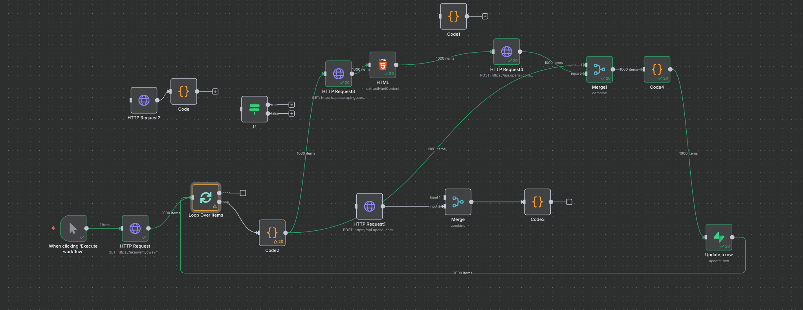
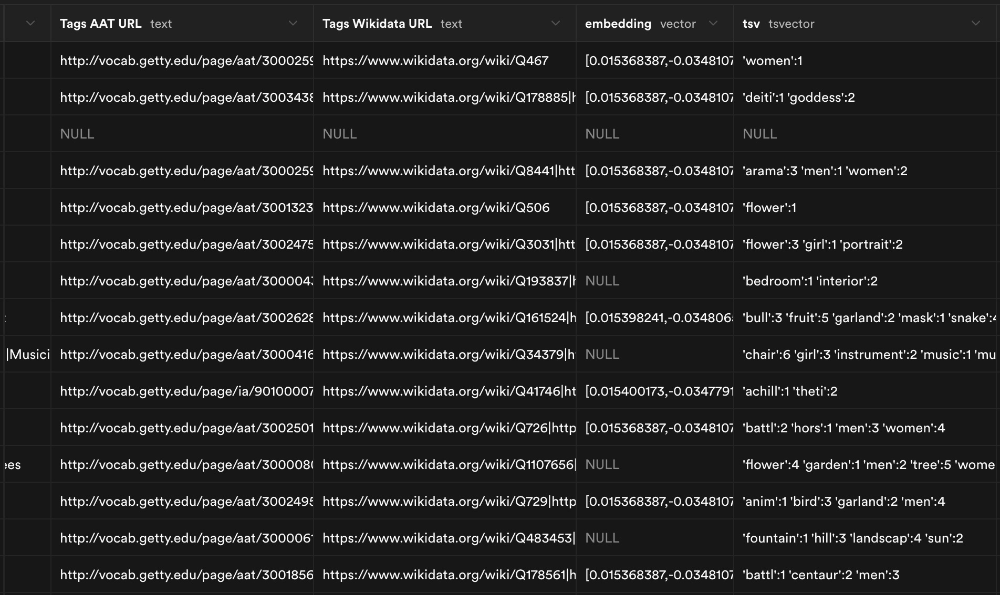
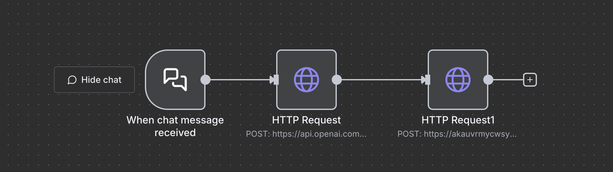

## Welcome to the AI Museum Scavenger Hunt, your personalized guide to exploring the vast collection of The Met! This tool creates a custom list of artworks based on your interests, turning your visit into a fun, focused scavenger hunt.

### Getting Started
#### 1. Choose a Topic of Interest

Select one of the pre-set buttons to choose your topic. OR, enter your own unique topic in the text box below. For example, you can type in "dragons, cats, space, myths".

Note: If you type a topic, it will override any button you may have clicked.

#### 2. Generate Your Map

Click the "Generate Map" button. The AI will curate a list of relevant artworks from the Met's collection—specifically from the artworks classified as "highlights".

#### 3. Review the Artworks

The generated map will display a list of artworks related to your topic (e.g., "Transportation Vehicles").

#### 4. Share and Print

You have three options for your map:

* Email to Myself: Send the list to your email.

* Print Map: Print the list to take with you (a full PDF map is coming soon).

* Generate Another Map: Start over with a new topic.

Enjoy exploring the museum through your personalized path!

-------------------------------

## Backend n8n Flow Preview

# Local Development

Use VS Code's Live Server extension to test the complete flow:

1. Right-click `index.html` in VS Code's file explorer
2. Select "Open with Live Server"

This will:
1. Start a local server (usually on port 5500)
2. Open your browser automatically
3. Enable CORS (needed for Met API requests)
4. Auto-reload when you make changes

## Testing the Complete Flow

1. Start at http://localhost:8000/index.html
   - Pick a topic and click Generate Map
   - Review the webhook response in the debug panel
   - Click "Proceed to Map" when ready

2. Test page: http://localhost:8000/itemSearch.html 
   - Direct testing of Met API object fetching
   - Enter object IDs manually or use presets
   - Click "Open in Map" to simulate the webhook flow

3. Results at http://localhost:8000/map.html
   - Displays fetched Met objects
   - Email or print your scavenger hunt

## Files

- `index.html` - Main entry point, calls webhook
- `itemSearch.html` - Test page for Met API
- `map.html` - Results display
- `assets/metObjects.js` - Met API utilities
- `styles.css` - Shared styles

## Experiment

The goal was to enable accurate free-form text to free-form text queries as opposed to searching by exact column attributes. We wanted users to hold a conversation with the AI, and for the AI to dynamically recommend art pieces based on a database.

### Problems to Solve

1. **LLMs are not retrieval systems**: We needed to separate the `object_id` from the query by creating embeddings of the database by row.
2. **Weak embeddings from database data**: The information in the database alone didn't create strong enough embeddings. Therefore, we needed to scrape the Met Museum URL for each item's description so that the embedding is a combination of the description and the row data.

### Solution

   

1. **Database storage**: The Met Museum database was stored on Supabase.

2. **Data fetching**: An HTTP Request node was used to fetch rows and return columns such as "Tags", "artist_name", "artist_bio", "art_name", "resource_link", etc.

3. **Parallel processing**: Two HTTP request branches were created from this point:
   - **Branch 1**: One HTTP Request node uses ScrapingBee to scrape the website for descriptions.
   - **Branch 2**: OpenAI HTTP Request nodes were used to generate embeddings for the descriptions and the row information.

   

4. **Data merging**: A Merge node was used so that the final output contains the untouched `object_id` and embeddings.

5. **Storage**: The embeddings were then stored back onto Supabase via matching `object_id`.

6. **Query time flow**:
   - The user triggers a chat.
   - An OpenAI node vectorizes the user prompt.
   - A second HTTP Request calls Supabase and runs a function that queries the database by embedding similarities.

   

### Result

The final flow works when a user prompts "I like horses" and the AI was able to return the top 5 results based on embedding similarities. However, the returned results were not relevant to the user's prompt. We think issue is that the embeddings generated from the user's prompt are too dissimilar to the embeddings created from art descriptions + row data. As a result, we did not proceed to integrate this dynamic system into the final working project. 